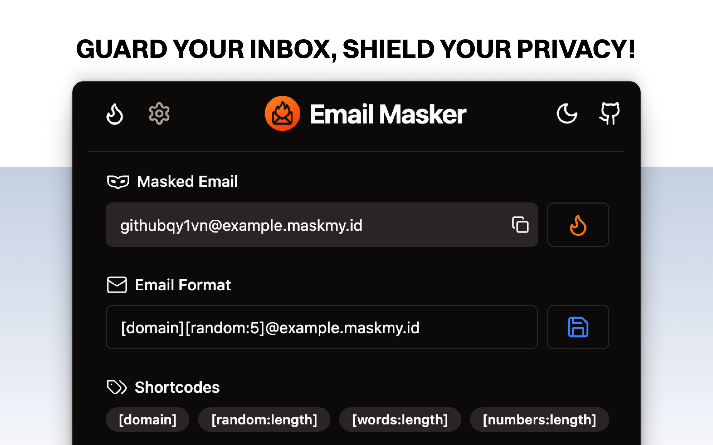
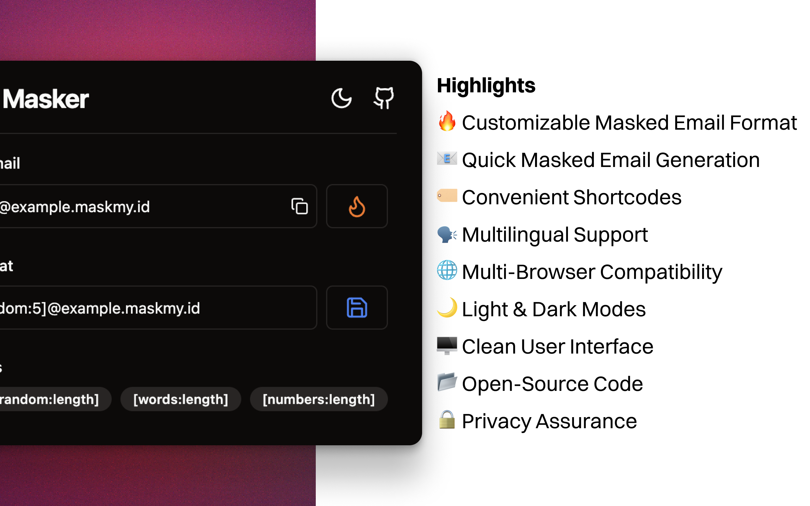
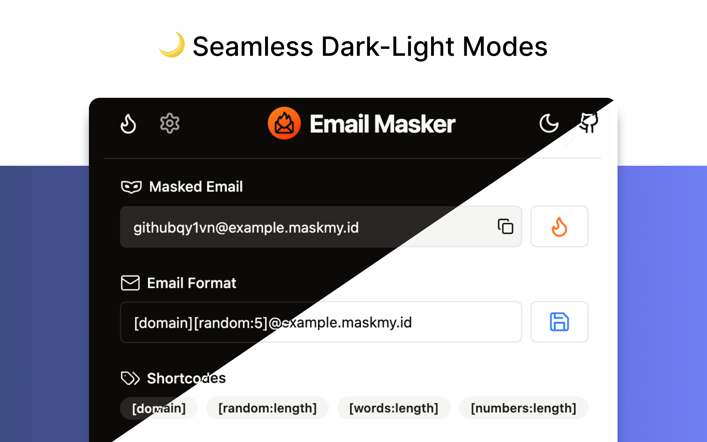
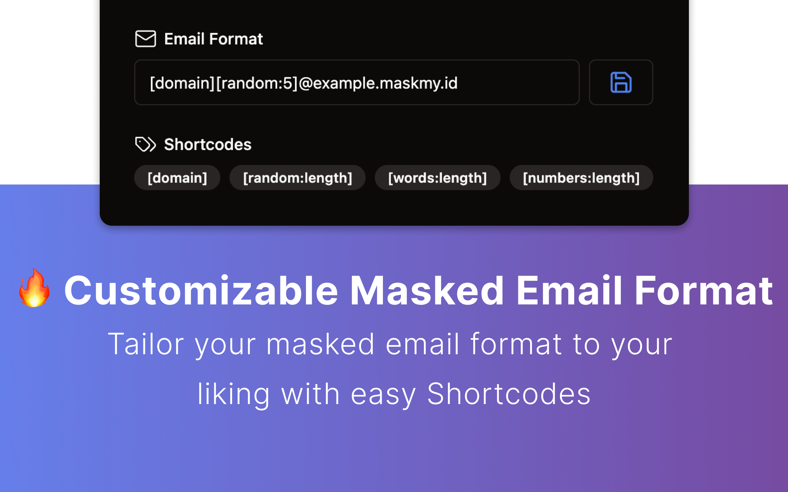
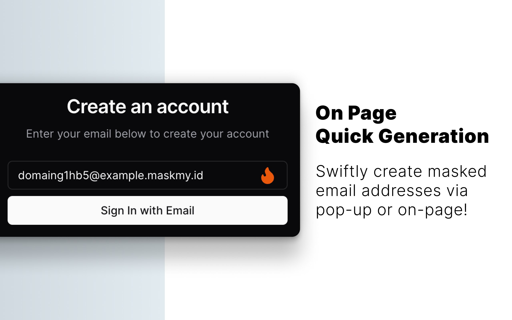

# Email Masker Browser Extension [](https://github.com/irazasyed/email-masker)

[](LICENSE.md)
[][link-cws]
[][link-amo]

> Email Masker is an open-source browser extension that helps you generate and use masked email addresses for your online accounts.
>
> It helps you protect your privacy and keep your inbox clean from spam.

Extension by [@irazasyed](https://github.com/irazasyed)



[][link-cws]
[][link-amo]
[][link-oas]

## Contents

- [Features](#features)
- [Supported Browsers](#supported-browsers)
- [Highlights](#highlights)
- [Email Format Templates](#email-format-templates)
- [Build and Automatic Releases](#build-and-automatic-releases)
- [Contributing](#contributing)
- [Security Vulnerabilities](#security-vulnerabilities)
- [Code of Conduct](#code-of-conduct)
- [License](#license)
- [Credits](#credits)
- [Disclaimer](#disclaimer)

## Features

**🔥 Customizable Masked Email Format**: Tailor your masked email format to your liking.

**📧 Quick Masked Email Generation**: Swiftly create masked email addresses via pop-up or on-page options.

**🏷️ Convenient Shortcodes**: Use domain, random strings/numbers, and random words in your email format.

**🗣️ Multilingual Support**: Enjoy the extension in multiple languages.

**🌐 Multi-Browser Compatibility**: Works on Chrome, Brave, Edge, Opera, Firefox, and More.

**🌙 Light & Dark Modes**: Choose your preferred interface theme.

**⚙️ Options**: Options to Enable/Disable on-page autofill, set default email format, and more.

**🖥️ Clean User Interface**: Minimalistic design for a focused experience.

**📂 Open-Source**: View and contribute to the source code.

**🔒 Privacy Assurance**: No data collection; generated emails are not stored.

## Supported Browsers

✅ Chrome / Brave / Edge / Opera / Any Chromium Browser.

✅ Firefox

✅ Orion / Any WebKit Browser that supports Web Extensions via Chrome Web Store/Firefox Addon Store.

### Other browsers

If you use another Chromium-based browser like Vivaldi, you can usually install the Chrome version.

## Highlights

<table>
    <tr>
        <th align="center">Highlights</th>
        <th align="center">Dark and Light Modes</th>
    </tr>
    <tr>
        <td align="center">
            
        </td>
        <td align="center">
            
		</td>
    </tr>
    <tr>
        <th align="center">Customizable Email Format</th>
        <th align="center">On-Page Quick Generation</th>
    </tr>
    <tr>
		<td align="center">
            
		</td>
		<td align="center">
            
        </td>
	</tr>
</table>

## Email Format Templates

Email Masker supports the following shortcodes that you can use in your email format.

- `[domain]` - Primary domain name from the current website (normalized).
- `[random:length]` - Random Alphanumeric string of n characters.
- `[words:length]` - Random words of n length.
- `[numbers:length]` - Random numbers of n length.

### Templates

Here are some email format templates you can use based on your preference, you may customize as you like.

**Default**

A combination of `[domain]` and `[random:5]` is used as the default email format.

```
[domain].[random:5]@example.com
```

The above format will generate email addresses like `github.29wun@example.com`

**Random Strings**

```
[random:8]@example.com
```

**Random Words**

```
[words:3]@example.com
```

**Random Numbers**

```
[numbers:8]@example.com
```

**Random Words and Numbers**

```
[words:2][numbers:4]@example.com
```

**Random Words and Numbers (With Separator)**

```
[words:2]-[numbers:4]@example.com
```

**Domain and Random Words**

```
[domain][words:2]@example.com
```

**Prefix and Random Strings**

```
prefix-[random:8]@example.com
```

## Saved formats and domains

The popup can save up to 10 email patterns. Use the Email Format dropdown to switch between them. Edit the pattern and click the save icon to update the selected preset, or choose **Save as new** to keep it as another preset. The counter shows how many presets are saved. Editing alone does not change the format used to generate addresses.

Patterns contain only the part before `@`, such as `[domain].[random:5]` or `[words:2][numbers:3]`. All saved patterns are shared by the email domains; changing the domain changes only the suffix. Existing settings are migrated automatically into the first preset. The selected pattern and domain are remembered, and at least one of each must remain saved.

## Build and Automatic Releases

The fork's `Build and release extensions` workflow builds both Chrome Manifest V3 and Firefox Manifest V2 packages whenever updates are pushed to `main` / `master`, a `v*` or numeric version tag is pushed, or the workflow is run manually. It installs dependencies from `package-lock.json`, runs the saved-format tests, builds both ZIPs, checks TypeScript and the Firefox package, then verifies manifest versions, extension versions, referenced resources and packaged files before publishing to GitHub Releases.

Ordinary updates use `v<package.json version>-build.<run number>` as the release tag; version-tag builds use the original tag. Successful releases are marked Latest and include `email-masker-<version>-chrome-mv3.zip`, `email-masker-<version>-firefox-mv2-unsigned.zip` and `SHA256SUMS.txt`. Rerunning a workflow updates the same release. Pull requests build and check packages without publishing. Both browser builds must pass before a release is published. No additional release secrets are required; only the release job has `contents: write` permission. Keep `.github/workflows/release.yml` when copying future upstream updates.

The browser ZIPs contain compiled extension files. GitHub's separate Source code downloads contain the repository at the release tag. The on-page flame icon uses a `url:` import so it is included as a real SVG file and its generated manifest entry points to an existing resource.

To build both packages locally:

```sh
npm ci
npm run package
```

Chrome: extract `build/chrome-mv3-prod.zip`, open `chrome://extensions`, enable Developer mode and load the extracted folder. Firefox: extract `build/firefox-mv2-prod.zip`, open `about:debugging#/runtime/this-firefox` and load `manifest.json` as a temporary add-on. The Firefox ZIP is unsigned; permanent installation in standard Firefox requires [Mozilla signing](https://extensionworkshop.com/documentation/publish/signing-and-distribution-overview/). GitHub Releases publishing does not sign the extension or submit it to a browser store. The existing `Submit to Web Store` workflow remains a separate manual Chrome store submission requiring `SUBMIT_KEYS`.

## Contributing

Please see [CONTRIBUTING](CONTRIBUTING.md) for details.

## Security Vulnerabilities

Please see [SECURITY](.github/SECURITY.md) for details.

## Code of Conduct

Please see [CODE_OF_CONDUCT](CODE_OF_CONDUCT.md) for details.

## License

MIT

## Credits

- [Irfaq Syed](https://github.com/irazasyed)
- [All Contributors](../../contributors)

[link-cws]: https://dub.sh/emailmasker-chrome 'Version published on Chrome Web Store'
[link-amo]: https://dub.sh/emailmasker-firefox 'Version published on Mozilla Add-ons'
[link-oas]: https://dub.sh/emailmasker-opera 'Version published on Opera Add-ons'
